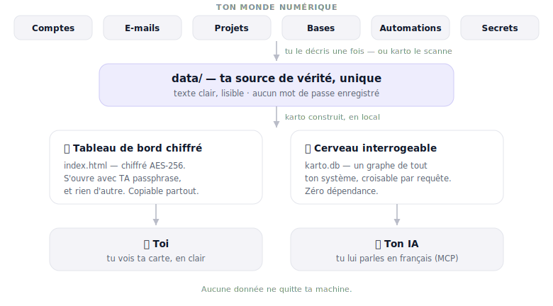

<!--
  README PUBLIC — destiné à devenir le README.md du dépôt public karto.
  Le README.md actuel à la racine est le manuel OPÉRATEUR (spécifique à l'instance de Owner,
  contient des détails d'infra perso). NE PAS le publier tel quel.
  Ce fichier-ci est public-safe : aucun identifiant personnel, orienté nouveaux contributeurs.
-->

<div align="center">

# karto

### La carte de tout ton monde numérique — chiffrée, locale, libre.

Tes comptes, tes e-mails, tes abonnements, tes mots de passe, tes automatisations…
**karto** en fait une carte claire et chiffrée, qui ne quitte jamais ta machine.

*Aucun serveur · aucun compte · aucune télémétrie · zéro dépendance.*

</div>



---

## C'est quoi un « système d'information » ? (et pourquoi tu en as un)

Le terme fait technique, mais il te concerne déjà. Ton **système d'information** (SI), c'est
l'ensemble de tout ce qui fait tourner ta vie numérique :

- tes **comptes** (Google, banque, réseaux, outils SaaS…),
- les endroits où vivent tes **données** (boîtes mail, cloud, bases de données),
- tes **abonnements**,
- et les **automatisations** qui relient tout ça (un mail qui part seul, une sauvegarde programmée…).

Avant, seules les grandes organisations en avaient un, géré par une équipe entière. Aujourd'hui,
**tu en as un aussi** — souvent plus gros que tu ne crois. Sauf que personne ne te l'a jamais
dessiné : il vit dans ta tête, et il grossit à chaque nouveau compte.

## Le problème

Tant que tout va bien, ça tient. Le jour d'un imprévu, ça coûte cher :

- *« C'était sur quel compte, déjà ? »* — tu fouilles dans quatre endroits.
- Un abonnement que tu **paies encore** et que tu avais oublié.
- Si tu perds ton PC ou ton téléphone, **qu'est-ce qui casse ?** Personne ne le sait.
- Un mot de passe **traîne en clair** quelque part — tu l'apprends le jour de la fuite.
- Une automatisation **tourne**… et tu ne sais plus comment elle marche.
- Toute cette connaissance est **dans ta tête**. Le jour où tu n'es plus là, elle part avec toi.

Les outils existants ne collent pas : un doc se périme dès le lendemain, un schéma ne se requête
pas, et les vraies plateformes d'architecture d'entreprise (LeanIX, Ardoq…) sont hors de prix et
pensées pour des DSI de grands groupes. **Rien n'existe pour un individu ou une petite structure**
qui veut une cartographie à jour, sécurisée, et interrogeable.

## Ce que karto résout

| | |
|---|---|
| 🗺️ **Tout au même endroit** | Comptes, bases, hébergements, automatisations, appareils — une vue d'ensemble, plus dix endroits. |
| 🔗 **Ce qui dépend de quoi** | « Si ça tombe, qu'est-ce qui casse ? » — le rayon d'impact en une requête. |
| 🔐 **Tes secrets, jamais exposés** | karto sait **où** vivent tes clés, **jamais leur valeur**. Branche ton coffre, rien n'est recopié. |
| 🧹 **Le ménage** | Abonnements oubliés, comptes morts, fichiers sensibles qui traînent : ils remontent, tu décides. |
| 🤖 **Tu lui parles** | Une question en français → ton IA répond depuis ta carte (via le standard MCP). |
| ☁️ **Tu ne perds rien** | Un fichier chiffré : copie-le dans iCloud, sur une clé USB. Perdre ton PC ne te fait rien perdre. |

## La solution en une phrase

> **karto est un tableau de bord chiffré + une base de connaissances requêtable qui cartographie
> tout ton SI — consultable par toi en visuel, et par ton IA en langage naturel — sans jamais
> exposer un seul secret en clair.**

---

## Comment ça marche

Tout part d'une **source unique** (`data/*.json`) : du texte clair, lisible, **sans aucun mot de
passe**. karto en fabrique deux artefacts régénérables :

1. **`index.html`** — un tableau de bord **chiffré (AES-256-GCM, PBKDF2-SHA256 600k)**. Il ne
   s'ouvre qu'avec ta passphrase, dans ton navigateur, même hors-ligne. La passphrase **est** la
   clé : le fichier peut être hébergé n'importe où sans rien révéler (*zero-knowledge*).
2. **`karto.db`** — un graphe de connaissances **SQLite** (`entity` + `edge`) que ton IA
   interroge en langage naturel via un **serveur MCP**, ou que tu requêtes en SQL/CLI.

```
data/*.json ──┬──► build.mjs ──► index.html   (dashboard chiffré, déployable partout)
 (vérité,     │
  zéro secret)└──► karto-db.mjs ──► karto.db ──┬──► CLI (karto-query.mjs)
                                               └──► MCP (karto_search / karto_entity /
                                                         karto_impact / karto_sql)
```

> **Principe de sécurité non négociable** : aucune **valeur** de secret n'est jamais écrite en
> clair sur disque. karto ne stocke que la **topologie** (les *emplacements*). Les valeurs ne
> vivent que chiffrées dans `index.html`, lues en RAM depuis tes `.env` locaux au moment du build.

---

## Démarrage rapide

**Prérequis** : [Node.js](https://nodejs.org) ≥ 22 recommandé (ou Node 18/20 + le binaire
`sqlite3`, présent d'origine sur macOS). Aucune autre dépendance.

```bash
git clone https://github.com/lbachelotcapitalb/karto.git
cd karto
node karto-init.mjs        # choisit une passphrase, construit le coffre chiffré, l'ouvre
```

Ensuite :

```bash
node karto-serve.mjs       # ouvre le dashboard en local (http://127.0.0.1)
node karto-query.mjs schema  # explore la base de connaissances en CLI (commence ici)
```

**Brancher ton IA** (Claude Code, Claude Desktop, Cursor…) :

```bash
node install-mcp.mjs       # enregistre le serveur MCP (lecture seule)
node install-mcp.mjs --write   # + outils d'édition opt-in (l'IA peut enrichir la carte)
```

Puis, en langage naturel : *« où est ma clé Resend ? »*, *« qu'est-ce qui casse si le VPS tombe ? »*,
*« quelles bases n'ont pas de sauvegarde ? »*.

---

## Architecture du dépôt

| Fichier | Rôle |
|---|---|
| `data/*.json` | **La source de vérité.** Topologie en clair, jamais de valeur de secret. |
| `build.mjs` | Fusionne les data → graphe + métamodèle EA → `index.html` (chiffré ou `--plain`). |
| `template.html` | L'UI du dashboard (vues, graphe, déchiffrement WebCrypto). |
| `karto-db.mjs` | Matérialise les data en `karto.db` (graphe requêtable). |
| `karto-query.mjs` | L'interface CLI de requête (`schema` / `search` / `entity` / `impact` / `sql`). |
| `karto-mcp.mjs` | Le serveur MCP (stdio, zéro-dép) — expose karto à toute IA. |
| `karto-sqlite.mjs` | Moteur SQLite portable : `node:sqlite` (Node 22+) **ou** repli binaire `sqlite3`. |
| `karto-collect.mjs` | Scanne la machine (périmètre = `karto.config.json`) → inventaire (noms/topologie). |
| `karto.config.json` | **Tout le softcode** : identité, périmètre de scan. Rien de spécifique n'est codé en dur. |

Artefacts **régénérables et gitignorés** : `index.html`, `karto.db`.

**Documentation** : [`AGENTS.md`](AGENTS.md) (point d'entrée pour une IA) ·
[`BACKEND.md`](BACKEND.md) (la base requêtable) · [`KARTO.md`](KARTO.md) (guide opérateur).

---

## Les principes de conception (lis-les avant de contribuer)

1. **Local-first & souverain.** Aucune valeur de secret ne quitte la machine. Aucun appel réseau
   au runtime du dashboard. Aucune télémétrie.
2. **Zéro dépendance.** Pas de `package.json`, pas de `npm install`. Node natif (`node:sqlite`,
   `WebCrypto`) + HTML/CSS/JS vanilla. Toute PR ajoutant une dépendance doit le justifier fort.
3. **Softcode total.** Rien de spécifique à un utilisateur n'est codé en dur — l'identité et le
   périmètre vivent dans `karto.config.json` ; la donnée dans `data/*.json`.
4. **Données ≠ code.** L'écriture (y compris par une IA) ne mute **que** `data/*.json`, jamais le
   code, et **refuse toute valeur ressemblant à un secret**.
5. **Lecture seule par défaut.** Le MCP n'écrit que si explicitement activé (`--write`).

## Contribuer

karto est jeune et utile à tout le monde — du non-technicien qui veut ranger sa vie numérique au
dev qui veut cartographier son infra. **Les contributions sont les bienvenues.**

**Bons premiers tickets :**

- 🌐 Une **API HTTP locale** (accès distant hors-MCP, avec token).
- 🔍 De **nouveaux scanners** d'inventaire (services, conteneurs, navigateurs…).
- 🗝️ Des **connecteurs de coffres** : 1Password (`op`), KeePassXC (`keepassxc-cli`) — l'abstraction `provider` existe déjà.
- 🪄 Un **assistant de premier lancement** pour les non-techniciens.
- 🌍 De l'**internationalisation** (l'UI est aujourd'hui en français).

**Comment :** ouvre une *issue* pour en discuter, fork, branche, PR. Garde les diffs petits et
respecte les cinq principes ci-dessus. Pour comprendre le modèle de données rapidement, lance
`node karto-query.mjs schema` et lis [`AGENTS.md`](AGENTS.md).

## Sécurité

Tu as trouvé une faille ? **N'ouvre pas d'issue publique.** Contacte les mainteneurs en privé.
karto manipule de la topologie sensible : on prend les rapports au sérieux.

## Licence

À définir (cible : licence open source permissive type MIT). En attendant, contacte les
mainteneurs avant tout usage en production ou redistribution.
